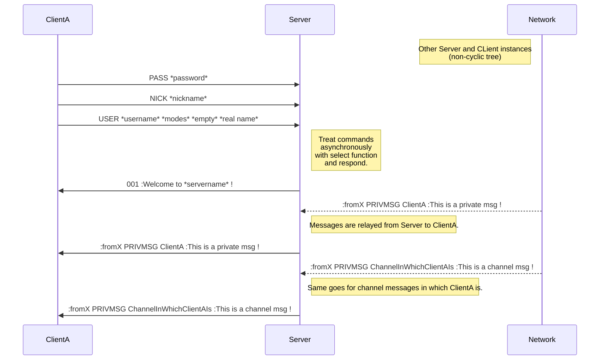

<!-- ~~~~~~~~~~~~~~~~~~~~~~~~~~~~~~~~~~~~~~~~~~~~~~~~~~~~~~~~~~~~~~~~~~~~~~~~~~~
# ############################################################################ #
# _____/\/\/\/\/\___/\/\____________/\/\/\/\/\/\_/\/\__/\/\__/\/\_____________ #
# ____/\/\____/\/\_______/\/\__/\/\____/\/\___________/\/\__/\/\__/\/\/\/\/\__ #
# ___/\/\/\/\/\___/\/\____/\/\/\______/\/\_____/\/\__/\/\__/\/\______/\/\_____ #
# __/\/\_________/\/\____/\/\/\______/\/\_____/\/\__/\/\__/\/\____/\/\________ #
# _/\/\_________/\/\__/\/\__/\/\____/\/\_____/\/\__/\/\__/\/\__/\/\/\/\/\_____ #
# ############################################################################ #
~~~~~~~~~~~~~~~~~~~~~~~~~~~~~~~~~~~~~~~~~~~~~~~~~~~~~~~~~~~~~~~~~~~~~~~~~~~~ -->

<!-- ~~~~~~~~~~~~~~~~~~~~~~~~~~~~~~[ Title ]~~~~~~~~~~~~~~~~~~~~~~~~~~~~~~~~ -->
<h1 align="left"> 'IRCPP' </h1>
<h3 align="left">Creation of an IRC server in <em>C++</em> !</h3>
<!-- ~~~~~~~~~~~~~~~~~~~~~~~~~~~~~~~~~~~~~~~~~~~~~~~~~~~~~~~~~~~~~~~~~~~~~~~ -->

<!-- ~~~~~~~~~~~~~~~~~~~~~~~~~~~[ Introduction ]~~~~~~~~~~~~~~~~~~~~~~~~~~~~ -->
<h4 align="left">
  <a href="https://datatracker.ietf.org/doc/html/rfc2810" target="_blank" rel="noreferrer">
    Figure explaining IRC's basic mechanics (links to RFC)
  </a>
</h4>

- Connections exchange through **TCP/IP** v4-6.
- Server can **connect to other Servers**.
- Network is a **non-cyclic tree**.
- There are **privileges** that affect which commands are available to clients.

<!-- ~~~~~~~~~~~~~~~~~~~~~~~~~~~~~~~~~~~~~~~~~~~~~~~~~~~~~~~~~~~~~~~~~~~~~~~ -->
